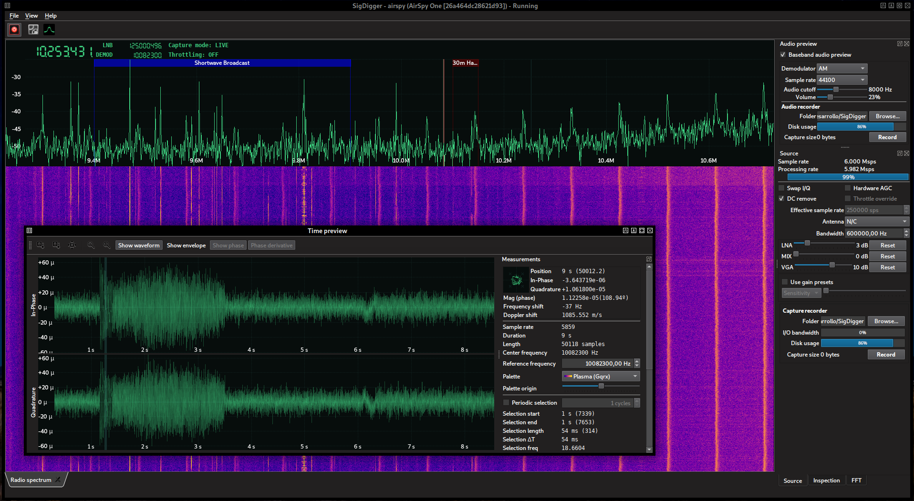

SigDigger is a graphical, digital signal analyzer I wrote in Qt5 for Unix systems like GNU/Linux or MacOS. Unlike existing  alternatives, SigDigger is not based on [GNU Radio](https://www.gnuradio.org/). Instead, it uses its own DSP library (sigutils) and a realtime signal analysis library (Suscan) that exploits multicore CPUs to distribute load. Also, SigDigger supports most SDR devices in the market thanks to [SoapySDR](https://github.com/pothosware/SoapySDR/wiki). Sigutils, Suscan and SigDigger are [software libre](https://en.wikipedia.org/wiki/Free_software), licensed under the terms of the [General Public License version 3](https://www.gnu.org/licenses/gpl-3.0.en.html).

 

## System requirements
SigDigger works in **x86-64** CPUs running **MacOS** or **GNU/Linux**. In terms of performance, it can beat Gqrx by a factor of 20% (measured as saved CPU usage).

There are plans to port SigDigger to additional operating systems and architectures. Both Suscan and Sigutils have been successfully built and run in armhf Linuxes (i.e. Raspberry Pi) in the past, but official support is on its way.

There are no plans to support Windows in the near future. There are some reasons for this:
a) I don't have any version of Windows installed in any of my computers at home
b) Both sigutils and suscan depend on libraries that are tied to Unix systems
c) Microsoft's Visual Studio C/C++ compiler does not offer a rational complex number API.
 
This is a whole new problem and requires careful addressing. This does not mean that I will not accept a port: if you are an experience Windows developer and loves porting software, your help will be greately appreciated :)

## Current features
- MacOS & GNU/Linux support.
-  Both realtime and replay analysis modes
-  Analog mono audio playback (AM, FM, LSB and USB)
-  Baseband recording (full spectrum and per-channel)
-  Per-device gain presents
-  Dynamic spectrum browsing
-  ASK, FSK and PSK inspection
- Gradient-descent SNR calculation
- Different spectrum sources (cyclostarionary analysis, signal power...)
- Symbol recording and visualization
- Doppler analysis
- Filename-based raw file parameter guessing
- Transition analysis
- Interactive Panoramic Spectrum view
- Waveform inspection window, including burst detection and limited off-line demodulation support
- Signal source decimation
- Bandplan information
- Audio channel recorder
- Blind parameter estimation
- Network broadcast of demodulated channel
- UDP broadcast of received samples and demodulated symbols
- Spectrum integrator (for radioastronomy enthusiasts like me!)

## Planned features
The following features are present in the Suscan core, but their exposition to the UI is in progress:

- Fast symbol autocorrelation analysis
- Automatic calculation of scrambling polynomials
- Symbol stream codecs

The following features have been presented in one of my talks, but they are not implemented neither in Suscan nor in SigDigger (yet):

- Symbol tagging (correspondence between symbols and groups of bits)
- Automatic symbol tagging guessing
- Automatic convolutional code detection
- Viterbi decoding

The following features are in an optimistic TODO, but they wil hopefully be part of SigDigger some day in the future:

- Make it available in the official repositories of some mainstream GNU/Linux distro (on its way!)
- OFDM inspector
- DSSS inspector
- Internationalization
- Turbocode / LDPC code support
- Bult-in decoder / demodulator tabs
- Python integration

## Documentation
This is work in progress, and some help will also be appreciated (see below).

## Downloading or building SigDigger
You can find build instructions in the [official GitHub repository](https://github.com/BatchDrake/SigDigger) . Pre-compiled binary releases are also available [here](https://github.com/BatchDrake/SigDigger/releases).

## Your software is cool, how could I help you?
The easiest and most useful thing you can do is to use it, distribute it, talk about it! Try it with different devices and configurations, force its limits, break it. All feedback will guide my effort into something that is useful for everyone.

If you find SigDigger useful and miss some documentation on the software, that's another way you can help. I'll make it available in this website.

If you are a programmer and you want to help, I would be happy to explain the internals to you and guide you along the process. You can also provide patches, improvements and bugfixes as pull requests in GitHub.

If you are good with languages and would like to do some translation work on SigDigger, you are welcome as well! As none of SigDigger components are internationalized yet, it will take me some to give you a list of strings you can translate. But if you are truly willing to do this, I will not mind prioritizing this before other tasks.

All help, of any kind, will be dully noted in the credits window.

## Acknowledgements
The latest UX improvements and MacOS X support have been possible thanks to the invaluable help of **Mehdi Asgari**.

Partial transcription of the spanish national frequency allocation table (CNAF) has also been possible thanks to **Shiki Owo**.

## Contact
You cand send me an [e-mail](mailto:BatchDrake@gmail.com) or reach me on [Twitter](https://twitter.com/BatchDrake).
