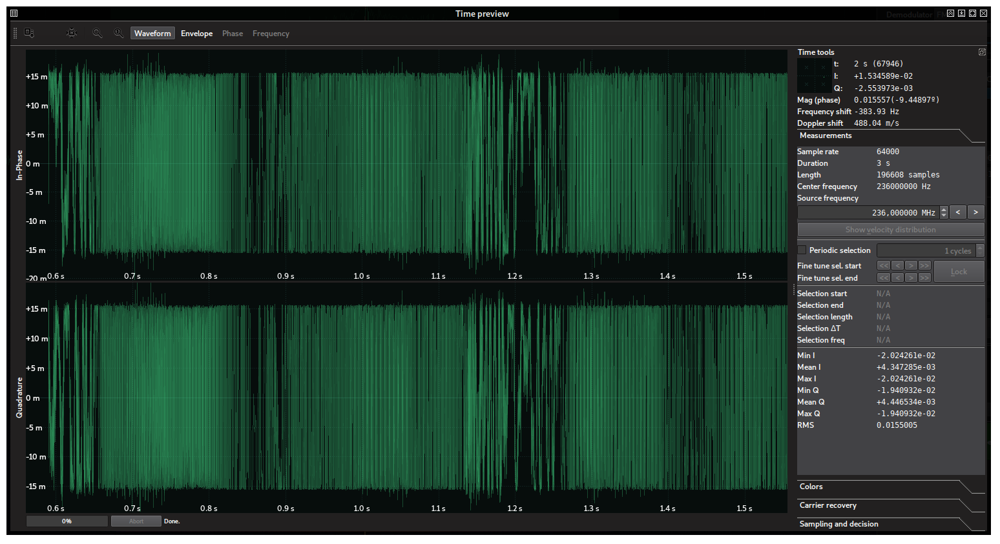

It's been a while since the last time I participated in any kind of CTF, but recently a new radio hacking-related contest came up and I couldn't help it but participate with the Spanish team [ID-10-T](https://twitter.com/id10t_ctf). Yep, I'm that basic. According to the organizers, [Capture The Signal](https://www.trendmicro.com/cts/)  (CTS) was a new challenge-based CTF that focuses exclusively on the reverse engineering of radio signals, organized by renowned community radio-hackers for researchers, hackers, and practitioners in the field. The interesting aspect of this contest was that it could be performed remotely, using a [set of tools provided](https://github.com/capturethesignal/cts-tools) by the organizers to download the I/Q samples ([standard little endian 32-bit IEEE 754 float](https://en.wikipedia.org/wiki/IEEE_754)) direcly from the contest servers by means of the message-passing library [ZeroMQ](https://zeromq.org/). Due to this particular setup, in which multiple participants had to have access to the signals in the same server, frequencies were mapped to ports. Therefore, tuning to a signal will be a synonym for connecting to a ZeroMQ port. Using ZeroMQ for remote signal access was not arbitrary: GnuRadio offers native ZeroMQ support with its RF Over IP module, and the organizers themselves insisted that the whole CTS could be performed using the legacy GnuRadio 3.7, although other tools could be used too (at least in the simplest challenges).
<!--more-->
Of course, I was planning to solve the challenges using SigDigger. However, the tools offered by the organizers depended on GnuRadio 3.7 as well (which doesn't run in my computer because of uninteresting Python 2.7 errors I wouldn't bother to fix) and interfacing SigDigger against ZeroMQ in less than a day was unfeasible this week. Fortunately, the organizers provided a docker image with preinstalled Python2.7/GnuRadio 3.7 along with a nice Python script that dumped the streaming samples in a given frequency to a FIFO named cts.fifo. Kind of hacky, but whis was something I could interface SigDigger with by simply taking the FIFO as a raw capture file.

Things started on Wednesday, April 30th 19:00 CEST (dubbed "the testing day"), when the organizers opened access to a 400 MHz signal, which was a pure 1 kHz sine wave with a ~102º phase turn in the IQ plane.

 
<center>*The test signal at 400 MHz.*</center>

With all my setup ready, we waited patiently for the true kick off the day after, gathering a bunch of people to help out with the contest. The challenges we solved are described below.

## Signal 1 (100)
The challenge included the following description:

> _If you haven't spent enough time to digest the detailed description under the play page, please do it right now, or you won't be able to play._
> 
> _If you're good to go, then see what's going on at 435MHz._
> 
> _You'll need the `--server-ip=` parameter to use the CTS client tools. To find that out, just resolve rf.cts.ninja_
> 
> _Once you've figured that out, enter the entire flag here!_

After tunning the frequency and getting the right sample rate as reported by the `rx_to_fifo.py` script (128 ksps in this case), the patterns in the spectrogram made us conclude that it was a simple spectrum painter. By shrinking SigDigger's window, reducing the FFT size to 1024 and increasing the FFT update interval to 60 fps, it was possible to read the flag directly: `HW2020:welcome!Listen@236MHz`

 
<center>*Spectrum painter at 435 MHz.*</center>

The flag also provided information on the next challenge. This was going to be a constant in this contest: you needed to get the flag right in order to get the frequency of the next challenge.

## Signal 2 (50)
According to the previous challenge, the tune frequency for Signal 2 was 236 MHz. The description of the challenge was:

> _Here we go again, another signal, another journey._
> 
> _If you solved the previous challenge, you know what to do by now ;-)_
> 
> _Once you decoded this signal, enter the flag here!_

The script reported a sample rate of 64 ksps. The spectrum reported by SigDigger was as follows:

 
<center>*Signal 2 at 236 MHz.*</center>

For people like us that spend a lot of time in the VHF and UHF bands, this spectrum looks familiar (modulated voice signal). One way to hear it is to fit the SigDigger's filter box to the signal's bandwidth, set the sample rate to the max (16000 kHz with this sample rate) and try different audio demodulators in the Audio preview pane until something is understandable. This happens when we set the demodulator to FM. A feminine voice pronounces the flag repeatedly: `hello hello hello 1.44 ghz sync A7`

There is another way to tell the modulation of the signal. After pressing the "Hold" button a couple of seconds, the SigDigger's Time Window will show up with the waveform of the captured signal during the time we pressed "Hold". We can tell by the waveform that it is a constant-envelope frequency-modulated signal. Essentially, a typical narrow band FM signal:

 
<center>_Waveform of signal 2 at 236 MHz._</center>

## Signal 3 (100)
The signal at 1.44 GHz (1440 MHz) was sampled at 25 ksps. The description was the following:
> _Whoa, you're rocking. Hey, did you notice that from the second challenge on, points are dynamic? This means that the initial points decay as more people solve them: so, hurry up!_
> 
>_Again, there's no secret sauce here. The secrets are in the signal. If you solved the previous challenge, you already know what to do!_
> 
> _Once you decoded this signal, enter the flag here!_

The signal was extremely narrow banded, and looked like this:

 
<center>*Signal 3 at 1440 MHz.*</center>

The discontinuities in the spectrogram suggested something like ASK or OOK. Indeed, by performing a time capture using SigDigger's Hold button:

 
<center>*Signal 3 at 1440 MHz, time domain*</center>

Which is basically a square wave from 0 to some maximum value. This is the definition of OOK. The problem with OOK is that it is an extremely broad term. Morse Code is OOK. PCB UARTs use OOK with TTL levels. Many RF remotes use Manchester-encoded OOKs. PCM is a kind of OOK. Even the more-than-a-century-old American Morse Code is OOK. We have to discard these in order to get the modulation right.

The sanest first step we can take is to measure the period of the shortest pulse in the signal. We can do this by means of the periodic selection feature in SigDigger's Time View. Choosing a reasonable number of cycles (selection subintervals, which we'll attempt to fit to the pulses manually) will produce a good approximation of the pulse length and frequency. 

 
<center>*Signal 3 pulse length measurement*</center>

This lets us conclude two things: the timing is virtually perfect, being the  pulse width an integer multiple of the shortest pulse (100 ms). So we can conclude this is machine-generated. Also, there are multiple pulse widths (1, 2, 3...) and therefore regular Morse code can be safely discarded (as it only consists on dots and dashes). Inspecting the different pulse widths lets us discard American Morse Code, and therefore we could interpret the pulses as bits: high level is one, while low level is 0. The bit length (100 ms) immediately lets us deduce the bit rate: 1 / 100ms = 10 bits per second (this is also printed in the measurements tab).

Now that we know it is OOK (which is a very particular type of amplitude-modulated dignal signal, this is, ASK) and the bit rate, we can proceed to demodulation. In the Time Window, the Sampling and Decision tab lets us convert these levels into bits. Simply capture enough bits, select "Amplitude", "Full capture", "Garder symbol recovery", set the Symbol Rate to 10 Hz and click "Sample". You should get something like this:

 
<center>*Signal 3 after sampling*</center>

The symbol view is black because the highest level is small and it is wrongly interpreted as low as the zero. However, the histogram above alredy shows two peaks, one for the zero and the other for the one. We can instruct SigDigger to use these peaks as decision thresholds by simply dragging one to another with the mouse. This is what the sampling window looks like now:

 
<center>*Signal 3 after decision threshold adjustment*</center>

There is something remarkable about this signal. If we set the row size to 8 (so that bits are splitted in groups of 8 and drawn on top of another), we see that the bit 0 (painted in black) is repeated every 8 bits. This is exactly what happens with printable ASCII characters! All English ASCII characters are below 128, and therefore their most significant bit is always 0.  

We can try to print this as-is. The "Save as" button allows us to save the demodulated signal in different formats. The most interesting one was saving it as a C array with zeroes and ones. We wrote a small C application that grouped these bits into bytes with MSB first (this is, the leading bits in every byte are the most significant ones: 0x05 would be encoded as 00000101, while in LSB it would be encoded as 10100000) and tried with different offsets from 0 to 7 to correct  any unavoidable bit misalignment, printing the output to the stdout. The choice of MSB over LSB was only based on previous experience with digital signals, being MSB more frequent than LSB. The resulting program looked like this:

```
#include <stdint.h>
#include <stdio.h>

static uint8_t data[237] = {
  0x00, 0x00, 0x01, 0x00, 0x01, 0x00, 0x01, 0x00, 0x01, 0x00, 0x01, 0x00, 0x01, 0x00, 0x01, 0x00, 
  0x01, 0x01, 0x00, 0x01, 0x00, 0x00, 0x01, 0x01, 0x01, 0x00, 0x00, 0x00, 0x00, 0x00, 0x00, 0x00, 
  0x00, 0x00, 0x00, 0x00, 0x01, 0x00, 0x01, 0x00, 0x01, 0x00, 0x01, 0x00, 0x00, 0x00, 0x01, 0x01, 
  0x00, 0x00, 0x01, 0x00, 0x01, 0x00, 0x00, 0x01, 0x00, 0x00, 0x01, 0x00, 0x00, 0x00, 0x01, 0x00, 
  0x01, 0x00, 0x01, 0x00, 0x01, 0x00, 0x00, 0x00, 0x01, 0x00, 0x00, 0x01, 0x01, 0x01, 0x00, 0x01, 
  0x00, 0x00, 0x00, 0x01, 0x01, 0x00, 0x01, 0x00, 0x01, 0x00, 0x00, 0x01, 0x01, 0x00, 0x00, 0x00, 
  0x01, 0x00, 0x00, 0x01, 0x01, 0x00, 0x01, 0x00, 0x00, 0x00, 0x01, 0x00, 0x00, 0x01, 0x01, 0x00, 
  0x01, 0x00, 0x01, 0x00, 0x00, 0x01, 0x00, 0x00, 0x00, 0x00, 0x01, 0x01, 0x01, 0x01, 0x00, 0x01, 
  0x00, 0x00, 0x00, 0x01, 0x00, 0x01, 0x01, 0x00, 0x00, 0x00, 0x01, 0x00, 0x01, 0x00, 0x00, 0x01, 
  0x01, 0x00, 0x01, 0x00, 0x01, 0x01, 0x00, 0x00, 0x01, 0x00, 0x01, 0x00, 0x00, 0x01, 0x01, 0x01, 
  0x00, 0x00, 0x01, 0x00, 0x00, 0x00, 0x00, 0x01, 0x01, 0x00, 0x00, 0x01, 0x01, 0x01, 0x00, 0x01, 
  0x00, 0x00, 0x00, 0x01, 0x01, 0x00, 0x00, 0x00, 0x00, 0x00, 0x01, 0x01, 0x01, 0x01, 0x00, 0x00, 
  0x00, 0x00, 0x00, 0x01, 0x01, 0x00, 0x01, 0x00, 0x00, 0x00, 0x01, 0x00, 0x00, 0x00, 0x01, 0x01, 
  0x00, 0x00, 0x01, 0x00, 0x01, 0x00, 0x01, 0x00, 0x01, 0x00, 0x01, 0x00, 0x01, 0x00, 0x01, 0x00, 
  0x01, 0x01, 0x00, 0x01, 0x00, 0x00, 0x01, 0x01, 0x01, 0x00, 0x00, 0x00, 0x00, };

int
main(void)
{
  int i, j;
  int p = 0;
  char b;
  
  for (j = 0; j < 8; ++j) {
    printf("Skip %d\n", j);
    p = j;
    b = 0;
    for (i = 0; i < sizeof(data); ++i) {
      b |= data[i] << (7 - p++);
      if (p == 8) {
        putchar(b);
        p = 0;
        b = 0;
      }
    }
  }
    
  return 0;
}
```

Piping it to `strings` to get rid of unprintable characters was all what we needed to get the flag (`FREQ:514MHz,SYNC:0x4F`):

```
(metalloid) % ./signal3 | strings
Skip 0
Skip 1
UiSkip 2
Skip 3
Te$U
DeUZpSkip 4
8Skip 5
Skip 6
tjbh
NSkip 7
FREQ:514MHz,SYNC:0x4FUU
```

A more informed way would be to take the previous challenge hint into account (sync A7). The sync value refered to the syncword pattern 10100111 right after the preamble (0101010101010101, MSB 0x55 0x55) we could use to determine the correct bit order and extract other fields like the length field (0x0015, Big Endian):

```
00000100  53 6b 69 70 20 37 0a 00  55 55 a7 00 15 46 52 45  |Skip 7..UU...FRE|
00000110  51 3a 35 31 34 4d 48 7a  2c 53 59 4e 43 3a 30 78  |Q:514MHz,SYNC:0x|
00000120  34 46 55 55 a7                                    |4FUU.|
00000125
```

## In the next post...
Things started to get interesting with challenge 3. In the next post I'll give details on how we dealt with a slightly more complex modulation, and why paying attention to the frequency histogram is more important than you think.

Stay tuned!