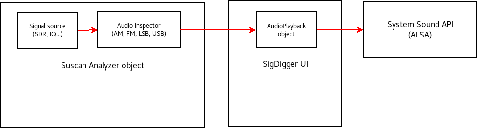

# SigDigger's Audio Preview feature
SigDigger's audio preview works thanks to two different components working together both in suscan and SigDigger UI. The following page describes the design of these two components, implementation quirks and limitations


## Overall architecture
Audio preview was implemented after the existing inspector API was fully rationalized, stabilized and tested. Since the current channelizer was several orders of magnitude faster than the first one (which was based on simple filtering and decimation), audio preview was implemented as a fourth class of channel inspector (in addition to PSK, FSK and ASK inspectors) whose demodulation algorithm could be dynamically changed in realtime, allowing USB, LSB, FM and AM.

Demodulated samples were filtered, decimated and immediately forwarded to the client application (SigDigger in this case) in a inspector message using Suscan Analyzer's message queue. These (`SUCOMPLEX`) samples are then consumed by a GUI object named AudioPlayback (`Audio/AudioPlayback.cpp` in SigDigger's tree), which descard the imaginary part and forward the real part to the soundcard. Audio samples are transfered to the sound card in batches called "audio buffers". 

 

## Suscan's Audio Inspector
Suscan audio inspector is implemented in `analyzer/inspector/impl/audio.c` under Suscan's source tree. The demodulation function (`suscan_audio_inspector_feed`) performs detection conditionally based on the `audio.demod` configuration parameter, using the following strategies:

### FM demodulation
During FM demodulation, audio inspector performs slope detection by multiplying the current and the conjugate of the previous sample, and retrieving  the argument (phase) of the result. This is later normalized by M_PI to have values between -1 and 1. This is actually an ingenious way to compute the derivative of the phase disregarding variations in the amplitude of the signal: as the conjugate of a complex number inverts the sign of its argument, the product of a complex number and the conjugate of another is another complex number whose argument is the subtraction of both.  Since the (numerical) derivative of the phase is proportional to the frequency, we are converting the instantaneous frequency of the signal into a float number.

```
y  = SU_C_ARG(x * SU_C_CONJ(prev_x)) / M_PI
```

### AM demodulation
AM demodulation is delegated in sigutils' PLL implementation which tracks AM carrier and attempts to center it near 0 Hz as much as possible. This is called **synchronous AM detection** as the detection code attempts to "synchronize" itself to the signal's carrier.

As it is impossible to prevent some noise to enter the PLL phase comparator (especially from both side bands), the resulting signal has a slightly oscillating DC offset. This DC offset is problematic, since as it approaches the amplitude of the signal, it may reduce its effective dynamic range, resulting in audio clipping. To prevent this, a slow integrator attempts to measure the instant value of the DC signal, subtracting it to the PLL output:

```
y = su_pll_track(&pll, x);
dc += beta * (y - dc);
y -= dc;
```

Where `beta` is a parameter between 0 and 1 which determines how slowly the DC component is estimated. Smaller values of beta produce very accurate DC estimations and therefore better DC offset removals. However, it may fail to detect the DC offset at all if it oscillates too fast. On the other hand, beta values close to 1 can estimate quickly oscillating DC offsets, but it is more severly affected by noise. Note that for the extreme cases, `beta = 0` behaves like a simple pass-through block while `beta = 1` behaves as a numerical differentiator. This makes sense, as the overall behavior should be the one of a high pass filter.

### USB demodulation
USB demodulation is probably the simplest of all demodulation schemes, although due to GUI behavior and how inspectors work can be a little confusing at first. 

When you open the SigDigger window in USB mode, you expect to leave the USB spectrum right to the center frequency marker in the spectrogram. This is, the interval of frequencies of interest is ```[central frequency, cutoff frequency].``` This makes sense, as if you isolate this part of the spectrum, you leave the left side to zero. Then, if you keep the real part of the time-domain signal, you are actually mirroring both sides fo the spectrum and adding them together (in this case, you would be simply mirroring the right part on top of the left part around the center frequency).

On the other hand, Suscan inspectors are instantiated given a center frequency and a channel bandwidth. This is, it will isolate ```[fc - bw/2, fc + bw/2]```. If we perform the strategy above directly on the channelized signal, half of the upper side band will be on the right hand of the channel spectrum, while the other half will be on the left side. If we keep the real part of this signal, we will be mirroring the whole spectrum and smashing both parts against each other.

To prevent this, both SigDigger and Suscan will conspire to give you the impression that the GUI is telling the trouth. First: when you demodulate using USB in SigDigger, SigDigger will actually tune the audio inspector to the frequency exactly in the middle between your selected center and cutoff, while keeping the bandwidth as the subtraction between cutoff and centralf frequencies. At the same time, Suscan will silently perform a frequency translation of the channel output to half the bandwidth, upwards. This way, the whole spectrum is right of the center frequency, as originally desired. Frequency translations are simply performed by multiplying a numerically controlled oscillator (NCO) to the time domain signal. The NCO must be configured to the right frequency (half the bandwidth). The detection code looks like this:


```
y = x * su_ncqo_read(&lo);
```

Note that we are not even keeping the real part of the signal. This automatically done for the inspector output in the Audio Playback object.

### LSB demodualtion
Same principle as the USB demodulation, although this time the spectrum is moved downwards to keep lower frequencies closer to the center frequency. In this case, we compute the **conjugate** of the NCO output, resulting in a complex exponential function with negative frequency which will translate the spectrum of the channel to the left side:

```
y = x * su_ncqo_read(&lo);
```

## SigDigger's Audio Playback object
Currently, Audio Playback only works in GNU/Linux due to my lack of other Unices and operating systems at home. However, the following ideas apply to most operating systems.

The big issue with audio playback code is that it is naturally asynchronous, as you will have to do other things (like producing more audio samples) while the current sample buffer is being played. Also, in the case of realtime devices like SDRs, we expect to do this in **realtime**. If we simply acquire, demodulate, and send the audio buffer to the soundcard, chances are that we will have audio underruns every now and then, resulting in poor audio quality. Reasons why this happens is that modern computer systems are simply not determinsitic: although you may be feeding the soundcard with a new buffer before the current one has finished, it is not guaranteed that you will make it on time in the next buffer, making the audio playback go choppy. We call this the _starving problem_ and is especially true for realtime cases.

To prevent this, the AudioPlayback object performs buffering along with other tricks to keep the soundcard busy most of the time.

### The strategy
We will assume that the underlying sound API is blocking, i.e. there will be some `write()`-like call in the API to transfer audio samples to the sound system that will put the calling thread to sleep until there is room for another bunch of samples. This implies that, if we want to perform real-time audio playback while preventing the GUI from freezing, we will need to use threads. In this case, we will rely on QThreads as they provide interesting inter-thread communication mechanisms, based on Qt signals and queued connections. In the GUI, every time we receive a bunch of audio samples and pass them to the Audio Playback object, the latter will forward them to the playback thread.

This, however, does not solve the starving problem mentioned above. We need to do some **buffering**: as soon as the AudioPlayback object is created and receives the first samples, it will not forward them directly to the playback thread. Instead, it will wait to gather enough full buffers (the exact number is `SIGDIGGER_AUDIO_BUFFER_MIN`, and is set experimentally to 5) before starting playback. When playback starts, audio buffers will be consumed more or less at the same rate they are generated: since we have 5 audio buffers in queue, if at some point the main thread goes slightly slower than the playback thread, the latter still has enough samples to keep the soundcard busy. Conversely, if the playback thread goes slightly slower that the main thread, the buffer queue will simply grow until samples are consumed (up to `SIGDIGGER_AUDIO_BUFFER_NUM` buffers, which is experimentally set to 10). Note that this works as long as these relative slow-downs happen for short periods of time, and compensate with each other with time.

However, in some cases (maybe because the system load is too high, of because there underlying sample source is reporting a wrong sample rate), we can't simply prevent the playback thread from starving. When this happens, the buffer queue is empty and, even if the main thread recovers from this situation, every new relative slow-down will result in additional starving situations and therefore choppy audio.

To prevent this corner case, the playback thread will stop as soon as it runs out of audio buffers, and will emit a `starving()`signal. The main thread will capture this signal and, if the number of queued samples is below certain value (`SIGDIGGER_AUDIO_BUFFERING_WATERMARK`, set experimentally to 2), it will transition back to the buffering state until there are enough samples to ensure fluent playback.

#### Optimizations
We've been mentioning a buffer que in the previous paragraphs, but we haven't described them yet. SigDigger allocates audio buffers that are 4 system pages long (in x86-64 systems, this is around 4 times 4096 = 16 KiB), resulting in 4096 32-bit float samples. Although transfering 16 KiB of information from one place to another is not a big deal nowadays, we can save a bulk copy by simply transfering references from one thread to another. 

In order to do this, the AudioPlayback object keeps an AudioBufferList object shared with the playback thread. This AudioBufferList object allocates `SIGDIGGER_AUDIO_BUFFER_NUM` buffers in total and keeps them in two separate lists: one list (the free list) contains all buffers that are ready to be populated by the main thread, while the other (the playback list) contains all the buffers that are ready to be transfered to the soundcard. When the main thread has finisihed filling the current audio buffer, moves it from the free list to the playback list by calling `commit()` on the AudioBufferList. In a similar way, when the playback thread is done with the current buffer, it puts it back to the free list by calling `relase()`.

## Porting tips
Since this strategy should work for basically any audio API supporting blocking `write()`s, the porting effort should be directed towards the system-dependant calls. These calls are found in the following methods:

```
void PlaybackWorker::play(void);
AudioPlayback::AudioPlayback(std::string const &dev, unsigned int rate);
AudioPlayback::~AudioPlayback();
```

`PlaybackWorker::play` performs the blocking calls to `write()`, while the constructor and destructor simply initialize and release the system audio object respectively.

A good porting approach would be to define an `AudioCodec` class that accepts some generic soundcard description as a string and a sample rate, and exposes a `write()` method in it, encapsulating all system-dependant sound system details. The AudioPlayback class is then modified to take a pointer to the AudioCodec as constructor argument, and to replace all sound calls to AudioCodec calls. Finally, depending on the target system, we build one AudioCodec implementation or other.

Of course this can be further improved by adding a method to `AudioCodec` to list all possible soundcards, or defining multiple `AudioCodec`s for the same system. This, of course, will imply GUI modifications to choose the appropriate sound output and configure it accordingly.
